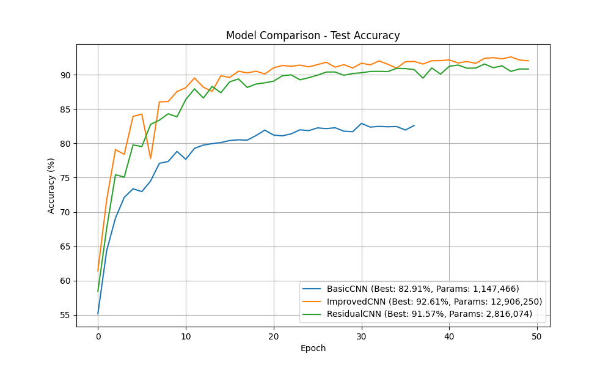
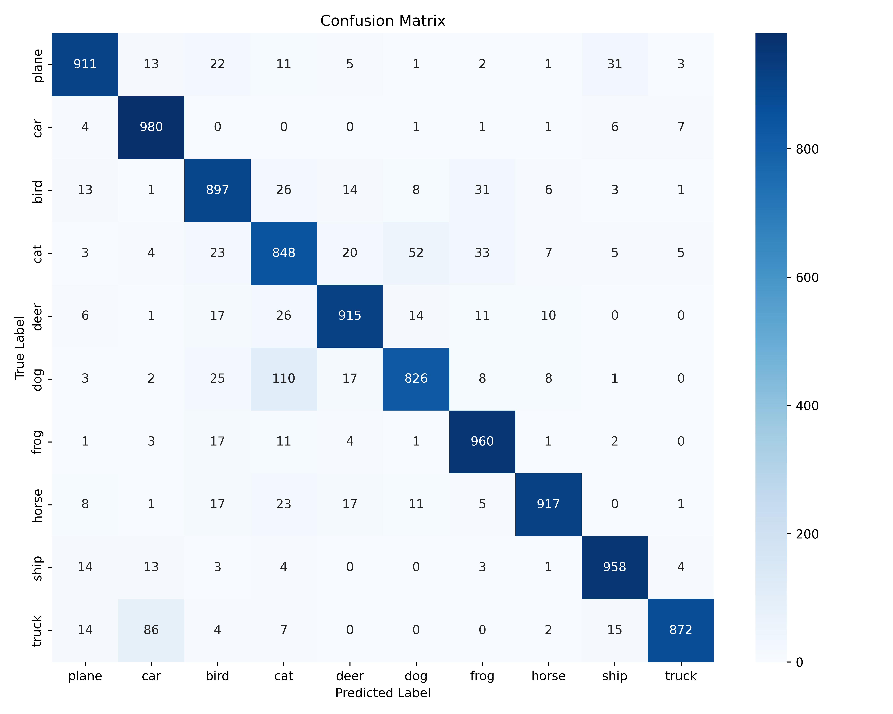
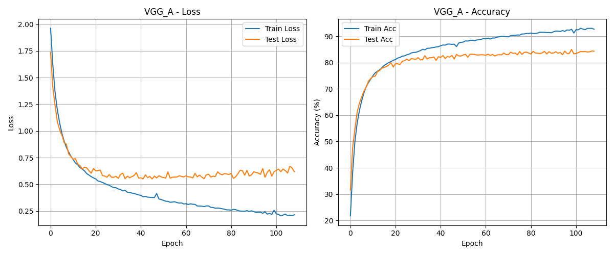
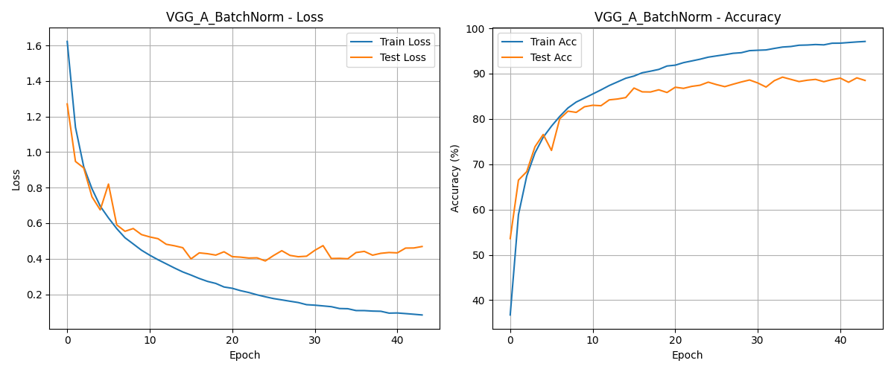
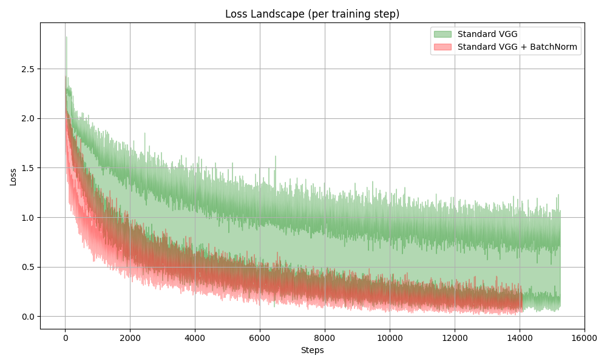

# 神经网络 PJ2

[Github链接](https://github.com/Monthlyaway/YanweiFu-Course-Projects/tree/main/pj2)

[Google Drive 全部模型和代码](https://drive.google.com/drive/folders/1n1_XjPbGacpE2vvVkP8O7Pa8oIhFam3k?usp=drive_link)

## CNN 实验

### 网络架构设计

本项目实现了三种不同复杂度的卷积神经网络架构，分别为BasicCNN、ImprovedCNN和ResidualCNN。

**BasicCNN**采用了最基础的CNN架构，包含3个卷积层（通道数分别为32、64、128）、3个最大池化层和2个全连接层。该网络使用ReLU作为激活函数，总参数量为1,147,466。

```python
class BasicCNN(nn.Module):
    def __init__(self):
        super(BasicCNN, self).__init__()
        self.conv1 = nn.Conv2d(3, 32, kernel_size=3, padding=1)
        self.pool = nn.MaxPool2d(2, 2)
        self.conv2 = nn.Conv2d(32, 64, kernel_size=3, padding=1)
        self.conv3 = nn.Conv2d(64, 128, kernel_size=3, padding=1)
        self.fc1 = nn.Linear(128 * 4 * 4, 512)
        self.fc2 = nn.Linear(512, 10)
```

**ImprovedCNN**在基础架构上加入了BatchNorm（BatchNorm）和Dropout技术。网络深度增加到6个卷积层，并在每个卷积层后添加BatchNorm层以稳定训练过程。在全连接层中使用0.5的Dropout防止过拟合。该网络总参数量为12,906,250。

**ResidualCNN**引入了残差连接机制，通过跳跃连接缓解深层网络的梯度消失问题。网络包含多个残差块，每个残差块由两个卷积层和一个恒等映射或投影映射组成。总参数量为2,816,074。

```python
class ResidualBlock(nn.Module):
    def __init__(self, in_channels, out_channels, stride=1):
        super(ResidualBlock, self).__init__()
        self.conv1 = nn.Conv2d(in_channels, out_channels, kernel_size=3, 
                               stride=stride, padding=1, bias=False)
        self.bn1 = nn.BatchNorm2d(out_channels)
        self.conv2 = nn.Conv2d(out_channels, out_channels, kernel_size=3, 
                               stride=1, padding=1, bias=False)
        self.bn2 = nn.BatchNorm2d(out_channels)
        self.shortcut = nn.Sequential()
        if stride != 1 or in_channels != out_channels:
            self.shortcut = nn.Sequential(
                nn.Conv2d(in_channels, out_channels, kernel_size=1, 
                          stride=stride, bias=False),
                nn.BatchNorm2d(out_channels)
            )
```

### 训练策略优化

在训练过程中采用了多种优化策略。首先，对训练数据使用了数据增强技术，包括随机裁剪（RandomCrop）和随机水平翻转（RandomHorizontalFlip），同时对所有数据进行了标准化处理。

```python
transform_train = transforms.Compose([
    transforms.RandomCrop(32, padding=4),
    transforms.RandomHorizontalFlip(),
    transforms.ToTensor(),
    transforms.Normalize((0.4914, 0.4822, 0.4465), (0.2470, 0.2435, 0.2616))
])
```

损失函数方面，BasicCNN使用标准的交叉熵损失，而ImprovedCNN采用了带标签平滑（label_smoothing=0.1）的交叉熵损失，有助于提高模型的泛化能力。所有模型均使用AdamW优化器，学习率设为0.001，权重衰减为5e-4。

训练过程中实现了早停机制，当验证集准确率连续6个epoch没有提升时自动停止训练，避免过拟合并节省计算资源。

### 实验结果分析



从模型对比图可以看出，三个模型在测试集上的表现存在明显差异。BasicCNN最终达到82.91%的测试准确率，训练过程相对平稳但收敛较慢。ImprovedCNN凭借BatchNorm和Dropout技术，达到92.61%的最佳准确率，且在训练初期就展现出快速收敛的特性。ResidualCNN获得91.57%的准确率，在参数量和性能之间取得了良好平衡。



通过Residual CNN的混淆矩阵可以观察到，模型在大部分类别上都有较好的分类效果，特别是飞机（plane）、汽车（car）和船（ship）等类别的识别准确率较高。然而，猫（cat）和狗（dog）之间存在较多的混淆，这可能是由于这两类动物在低分辨率图像中具有相似的视觉特征。

### 网络可视化


对第一层卷积核的可视化展示了网络学习到的低级特征检测器。可以观察到，这些3×3的卷积核学习到了不同方向的边缘检测器、颜色检测器和纹理模式。这些基础特征为后续层次的高级特征提取奠定了基础。

### 性能总结

| 模型 | 参数量 | 最佳测试准确率 | 训练时间 |
|------|--------|----------------|----------|
| BasicCNN | 1,147,466 | 82.91% | 最快 |
| ImprovedCNN | 12,906,250 | 92.61% | 较慢 |
| ResidualCNN | 2,816,074 | 91.57% | 中等 |

综合考虑模型性能和计算效率，ImprovedCNN虽然参数量最大，但取得了最佳的分类性能。ResidualCNN在保持较少参数量的同时实现了接近最优的性能，展现了残差结构的优势。实验结果表明，BatchNorm、Dropout和残差连接等现代深度学习技术对提升CIFAR-10分类任务的性能具有显著作用。


## VGG-A网络架构与BatchNorm对比

### 实验设置与网络实现

本实验对比了标准VGG-A网络与添加BatchNorm（BatchNorm）后的性能差异。VGG-A网络采用了经典的卷积神经网络架构，包含5个卷积阶段，每个阶段由1-2个卷积层组成，后接最大池化层进行下采样。网络最后通过3个全连接层输出10类分类结果。

标准VGG-A网络的卷积层序列为：64-128-256-256-512-512-512-512通道，每个卷积层后直接使用ReLU激活函数。而VGG_A_BatchNorm在每个卷积层之后、ReLU激活之前插入了BatchNorm层：

```python
# VGG_A_BatchNorm中的一个卷积块示例
nn.Conv2d(inp_ch, 64, 3, padding=1),
nn.BatchNorm2d(64),
nn.ReLU(True),
```

实验采用CIFAR-10数据集，使用Adam优化器，并设置了4个不同的学习率[1e-3, 2e-3, 1e-4, 5e-4]来探索损失景观的变化。训练过程中记录了每个批次的损失值，用于后续的损失景观分析。

### 训练性能对比分析





**x轴不同！VGG BatchNorm 在45个epoch的时候早停**

从训练曲线对比可以观察到显著差异。标准VGG_A网络在训练初期损失下降较慢，需要约100个epoch才能达到稳定状态，最终测试准确率稳定在84%左右。训练损失和测试损失之间存在明显差距，表明模型存在一定程度的过拟合。

相比之下，VGG_A_BatchNorm展现出更优越的训练特性。模型在前20个epoch内快速收敛，损失函数急剧下降，测试准确率迅速提升至88%以上。更重要的是，训练损失和测试损失之间的差距明显缩小，说明BatchNorm有效缓解了过拟合问题。最终模型在约45个epoch时通过早停机制结束训练，达到了约89%的测试准确率。

### Loss Landscape可视化分析



Loss Landscape图展示了两种模型在不同学习率下的损失变化范围。绿色区域代表标准VGG网络，红色区域代表添加BatchNorm后的网络。每个彩色区域通过以下算法生成：

```
算法：Loss Landscape生成
输入：学习率集合 LR = [1e-3, 2e-3, 1e-4, 5e-4]
     模型类型 model_type ∈ {VGG_A, VGG_A_BatchNorm}
输出：min_curve, max_curve

1. 初始化 step_losses_collection = []
2. for lr in LR:
3.     model = 初始化模型(model_type)
4.     optimizer = Adam(model.parameters(), lr=lr)
5.     step_losses = []
6.     for epoch in range(num_epochs):
7.         for batch in trainloader:
8.             loss = 前向传播并计算损失
9.             反向传播并更新参数
10.            step_losses.append(loss.item())
11.    保存step_losses到文件
12.    step_losses_collection.append(step_losses)
13. 
14. # 计算min_curve和max_curve
15. min_length = min([len(losses) for losses in step_losses_collection])
16. for i in range(min_length):
17.    losses_at_step_i = [losses[i] for losses in step_losses_collection]
18.    min_curve[i] = min(losses_at_step_i)
19.    max_curve[i] = max(losses_at_step_i)
20. 
21. 绘制填充区域(steps, min_curve, max_curve)
```

从图中可以明显看出BatchNorm对优化过程的积极影响。标准VGG网络（绿色）的Loss Landscape呈现较大的波动范围，特别是在训练初期（0-4000步），不同学习率下的损失值差异巨大，表明优化过程对学习率的选择极为敏感。随着训练进行，虽然损失逐渐下降，但仍保持较宽的变化区间。

添加BatchNorm后的网络（红色）展现出更加平滑和稳定的Loss Landscape。损失值的变化范围显著缩小，不同学习率下的表现更加一致。这种稳定性在整个训练过程中都得以保持，使得优化器能够更可靠地找到良好的参数配置。

### BatchNorm的优化机制

BatchNorm通过对每个通道的激活值进行标准化处理，重新参数化了优化问题。对于卷积神经网络，BatchNorm的数学表达式为：

$O_{b,c,x,y} \leftarrow \gamma_c \frac{I_{b,c,x,y} - \mu_c}{\sqrt{\sigma_c^2 + \epsilon}} + \beta_c \quad \forall b, c, x, y$

其中，$I_{b,c,x,y}$ 和 $O_{b,c,x,y}$ 分别表示BatchNorm层的输入和输出张量，维度对应批次$b$、通道$c$和空间维度$x,y$。BatchNorm首先计算每个通道的均值：

$\mu_c = \frac{1}{|B|} \sum_{b,x,y} I_{b,c,x,y}$

这里$B$包含了整个mini-batch中通道$c$的所有激活值。然后将中心化的激活值除以标准差$\sigma_c$（加上$\epsilon$保证数值稳定性）。最后通过可学习的仿射变换参数$\gamma_c$和$\beta_c$进行缩放和平移。

这种机制使得Loss Landscape变得更加平滑，具体表现在以下几个方面：

**损失函数的Lipschitz性质改善**。从Loss Landscape图可以看出，BatchNorm显著降低了损失函数的变化率。在相同的参数更新步长下，损失值的变化更加可预测，这意味着梯度下降算法的局部线性近似更加准确。

**梯度的稳定性增强**。标准网络在不同学习率下表现出巨大差异，说明梯度的尺度变化剧烈。BatchNorm通过规范化每层的输入分布，使得梯度在反向传播过程中保持相对稳定的尺度，从而允许使用更大的学习率而不会导致训练发散。

**优化路径的平滑化**。较窄的损失变化区间表明，BatchNorm创建了一个更加平滑的优化路径。这使得优化器能够采取更大、更确定的步长，加快收敛速度。从训练曲线中可以看到，BatchNorm版本在前20个epoch就基本完成了主要的优化过程。


### 实验结论

通过对VGG-A网络添加BatchNorm层，我们观察到了显著的性能提升和训练稳定性改善。BatchNorm不仅加快了收敛速度（从100个epoch减少到45个epoch），还提高了最终的分类准确率（从84%提升到89%）。更重要的是，Loss Landscape分析揭示了BatchNorm的本质作用：通过创建更加平滑和稳定的optimization landscape，使得基于梯度的优化算法能够更高效地工作。这种机制解释了为什么BatchNorm能够允许使用更大的学习率、加速训练过程，并最终获得更好的模型性能。